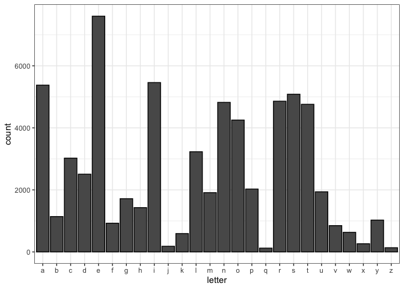

```
## 
## Attaching package: 'purrr'
```

```
## The following object is masked from 'package:magrittr':
## 
##     set_names
```

```
## The following object is masked from 'package:data.table':
## 
##     transpose
```

## Frequency of letters in English words

### Words in the dictionary

I downloaded a text file that consists of 10,000 English words (USA spelling) from the dictionary. I split up each word into characters and did a count.


```r
# read the text file 
dictionary_txt <- readLines("../data/wordlist.10000.txt")

# split words up into characters and do a count
dictionary_counts <- dictionary_txt %>% 
  paste(collapse="") %>% 
  strsplit(split="") %>% unlist %>% 
  `[`(!. %in% c("", " ", ".", ",")) %>% 
  table

dictionary_counts_dt <- data.table(letter = names(dictionary_counts), count = as.numeric(dictionary_counts), stringsAsFactors=FALSE)
dictionary_counts_dt <- dictionary_counts_dt[order(-count)]

dictionary_counts_dt
```

```
##     letter count
##  1:      e  7601
##  2:      i  5461
##  3:      a  5378
##  4:      s  5085
##  5:      r  4860
##  6:      n  4822
##  7:      t  4760
##  8:      o  4252
##  9:      l  3231
## 10:      c  3025
## 11:      d  2507
## 12:      p  2027
## 13:      u  1939
## 14:      m  1912
## 15:      g  1717
## 16:      h  1429
## 17:      b  1141
## 18:      y  1027
## 19:      f   927
## 20:      v   849
## 21:      w   632
## 22:      k   592
## 23:      x   264
## 24:      j   183
## 25:      z   136
## 26:      q   123
##     letter count
```

#### Plot the frequency table for visualization.


```r
ggplot(data = dictionary_counts_dt, aes(x = letter, y = count)) +
    geom_bar(stat="identity", position=position_dodge(), colour="black") +
  theme_bw()
```

<!-- -->

### Words based on text usage

Hmm, let's try counting letters based on the usage of English words.


```r
# read the text file 
english_txt_usage <- fread("../data/cornell_math.csv")

english_txt_usage
```

```
##     Letter Count
##  1:      e 21912
##  2:      t 16587
##  3:      a 14810
##  4:      o 14003
##  5:      i 13318
##  6:      n 12666
##  7:      s 11450
##  8:      r 10977
##  9:      h 10795
## 10:      d  7874
## 11:      l  7253
## 12:      u  5246
## 13:      c  4943
## 14:      m  4761
## 15:      f  4200
## 16:      y  3853
## 17:      w  3819
## 18:      g  3693
## 19:      p  3316
## 20:      b  2715
## 21:      v  2019
## 22:      k  1257
## 23:      x   315
## 24:      q   205
## 25:      j   188
## 26:      z   128
##     Letter Count
```

```r
# plot bar graph for text usage frequency
ggplot(data = english_txt_usage, aes(x = Letter, y = Count)) +
    geom_bar(stat="identity", position=position_dodge(), colour="black") + 
    theme_bw()
```

<!-- -->

## Frequency of letters in ciphertext

For this part, I'm going to get a count of the letters in my cipher text.


```r
cipher_txt <- tolower("Max wxybgbmbhg hy ubhbgyhkftmbvl bl vnkkxgmer vhgmkhoxklbte, unm ubhbgyhkftmbvl vtg ux ehhlxer wxybgxw tl max nlx hy vhfinmxkl tgw vhfinmxk lvbxgvx mh lmnwr ubhehzbvte jnxlmbhgl. Bm yhkfl max bgmxklxvmbhg uxmpxxg fhexvnetk ubhehzr (tgw kxetmxw ubhehzbvte wblvbiebgxl) tgw vhfinmbgz lvbxgvx. Mabl bgmxkwblvbiebgtkr ybxew bgoheoxl kxlxtkvaxkl pah phkd tm ftgr wbyyxkxgm ihbgml hg max vhfinmxk lvbxgvx-ubhehzr lixvmknf: Ykhf mahlx pah tkx wxoxehibgz gxp kxexotgm tezhkbmafl, mh mahlx pah tkx wxoxehibgz tgw nlbgz vhfinmtmbhgte tiiebvtmbhgl mh lmnwr ubhehzbvte iaxghfxgt, ztbg gxp bglbzam bgmh max ebyx lvbxgvxl, bwxgmbyr gxp wknz mtkzxml xmv. Mabl ybxew bl vnkkxgmer xoheobgz, unm hgx ihbgm bl tzkxxw nihg: Ubhbgyhkftmbvl bl t uehllhfbgz ybxew pbmabg pabva maxkx kxftbg ftgr lbzgbybvtgm wblvhoxkbxl mh ux ftwx.")

# split words up into characters and do a count
cipher_txt_counts <- cipher_txt %>% 
  paste(collapse="") %>% 
  strsplit(split="") %>% unlist %>% 
  `[`(!. %in% c("", " ", ".", ",")) %>% 
  table

cipher_txt_counts_dt <- data.table(letter = names(cipher_txt_counts), count = as.numeric(cipher_txt_counts), stringsAsFactors=FALSE)
cipher_txt_counts_dt <- cipher_txt_counts_dt[order(-count)]

cipher_txt_counts_dt
```

```
##     letter count
##  1:      b    76
##  2:      x    76
##  3:      h    60
##  4:      g    56
##  5:      m    54
##  6:      l    45
##  7:      t    36
##  8:      k    35
##  9:      v    34
## 10:      e    31
## 11:      w    23
## 12:      a    20
## 13:      f    19
## 14:      n    18
## 15:      z    18
## 16:      y    17
## 17:      i    16
## 18:      u    14
## 19:      r    11
## 20:      p    10
## 21:      o     9
## 22:      :     2
## 23:      -     1
## 24:      (     1
## 25:      )     1
## 26:      d     1
## 27:      j     1
##     letter count
```

#### Plot the frequency table for visualization.


```r
ggplot(data = cipher_txt_counts_dt, aes(x = letter, y = count)) +
    geom_bar(stat="identity", position=position_dodge(), colour="black") +
  theme_bw()
```

<!-- -->

## Decrypting the ciphertext

Based on the letter frequency, "b" and "x" could be "e" since they're the same count. Let's try searching for the key using these assumptions.

### Shift 23: "e" to "b"


```r
# clean data
clean_ciphertxt <- gsub("[[:punct:]]", "", cipher_txt)
array <- strsplit(clean_ciphertxt, " ")

# decrypt
decrypt <- map(array, ~ caesar(.x, shift = -3, decrypt = TRUE))
tolower(paste(unlist(decrypt), "", collapse = ''))
```

```
## [1] "pda zabejepekj kb xekejbkniwpeyo eo yqnnajphu ykjpnkranoewh xqp xekejbkniwpeyo ywj xa hkkoahu zabejaz wo pda qoa kb ykilqpano wjz ykilqpan oyeajya pk opqzu xekhkceywh mqaopekjo ep bknio pda ejpanoaypekj xapsaaj ikhayqhwn xekhkcu wjz nahwpaz xekhkceywh zeoyelhejao wjz ykilqpejc oyeajya pdeo ejpanzeoyelhejwnu beahz ejrkhrao naoawnydano sdk skng wp iwju zebbanajp lkejpo kj pda ykilqpan oyeajyaxekhkcu olaypnqi bnki pdkoa sdk wna zarahklejc jas naharwjp whcknepdio pk pdkoa sdk wna zarahklejc wjz qoejc ykilqpwpekjwh wllheywpekjo pk opqzu xekhkceywh ldajkiajw cwej jas ejoecdp ejpk pda heba oyeajyao ezajpebu jas znqc pwncapo apy pdeo beahz eo yqnnajphu arkhrejc xqp kja lkejp eo wcnaaz qlkj xekejbkniwpeyo eo w xhkookiejc beahz sepdej sdeyd pdana naiwej iwju oecjebeywjp zeoykraneao pk xa iwza "
```

### Shift 19: "e" to "x"


```r
decrypt <- map(array, ~ caesar(.x, shift = -7, decrypt = TRUE))
tolower(paste(unlist(decrypt), "", collapse = ''))
```

```
## [1] "the definition of bioinformatics is currently controversial but bioinformatics can be loosely defined as the use of computers and computer science to study biological questions it forms the intersection between molecular biology and related biological disciplines and computing science this interdisciplinary field involves researchers who work at many different points on the computer sciencebiology spectrum from those who are developing new relevant algorithms to those who are developing and using computational applications to study biological phenomena gain new insight into the life sciences identify new drug targets etc this field is currently evolving but one point is agreed upon bioinformatics is a blossoming field within which there remain many significant discoveries to be made "
```

## The end.
